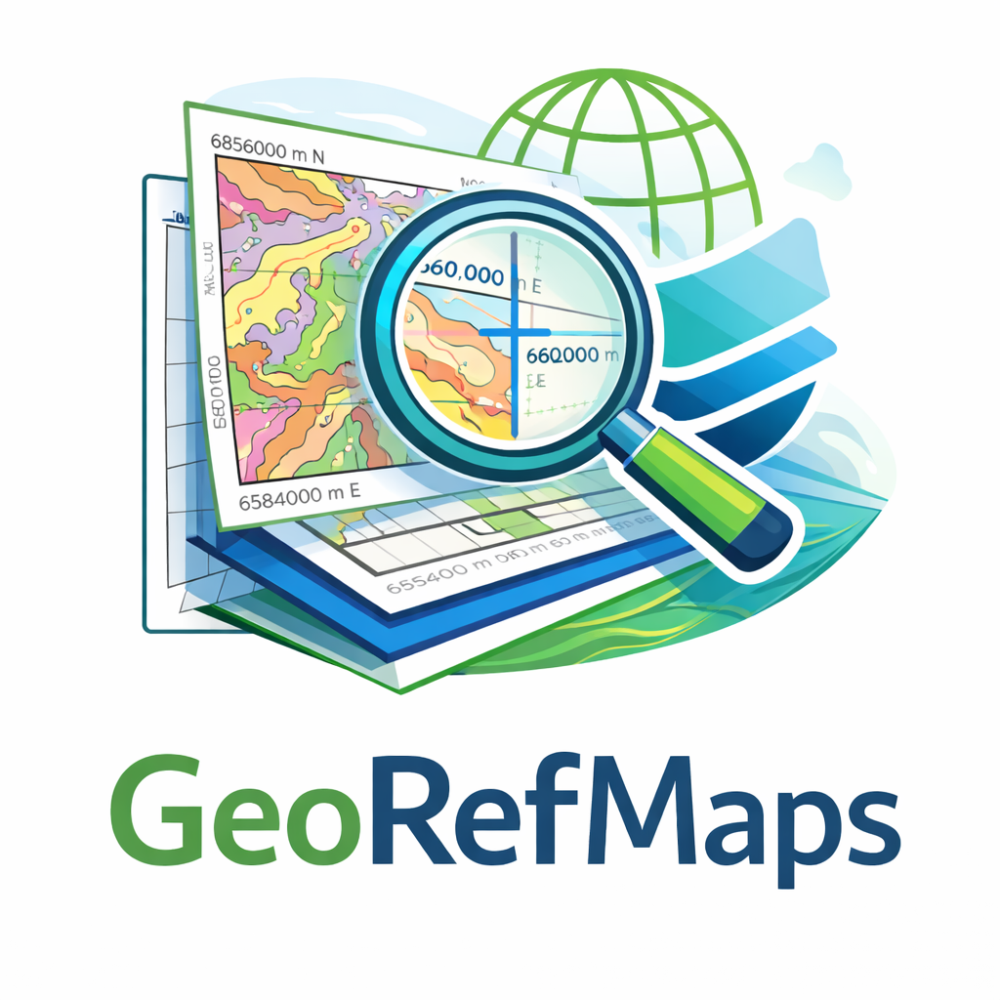

<div align="center">
  

# GeoRefMaps

**Semi-automatic georeferencing for geological maps and scanned figures**

Extract coordinate labels from PDF or raster borders, review four corner
controls and export a documented GeoTIFF without hiding CRS assumptions.

[](https://github.com/jordan-zav/GeoRefMaps/releases/latest)
[](https://www.python.org/)
[](#supported-inputs)
[](LICENSE)

</div>

> [!WARNING]
> Automatic text detection proposes control points; it does not prove that the
> map datum, UTM zone or corner assignment is correct. Review every corner and
> compare the result with a trusted reference layer before using it analytically.

## Workflow at a glance

```text
PDF page / scanned map / raster image
                  │
                  ▼
 Vector text extraction ──or── border-focused OCR
                  │
                  ▼
 Coordinate candidates + grid-line matching
                  │
                  ▼
 Four editable corner controls + explicit source CRS
                  │
                  ▼
 JSON GCP record ──► georeferenced/reprojected GeoTIFF
```

## Capabilities

| Area | Current support |
| --- | --- |
| PDF | First-page rendering and vector-text extraction with PyMuPDF |
| Raster | PNG, JPEG and TIFF image input |
| OCR | Tesseract fallback focused on map-border regions |
| Coordinates | Decimal/DMS geographic labels and projected easting/northing candidates |
| Matching | Corner templates and raster grid-line assistance |
| Review | Manual correction of proposed corner values and modes |
| Export | JSON control-point record and RGB GeoTIFF |
| Reprojection | Optional output EPSG through Rasterio |

## Supported inputs

- PDF (`.pdf`), currently processing the selected/first page;
- PNG (`.png`);
- JPEG (`.jpg`, `.jpeg`); and
- TIFF (`.tif`, `.tiff`).

Text-based PDFs are preferred because their labels can be extracted without
OCR. Scanned figures require a working Tesseract installation and sufficiently
clear border labels.

## Spatial-reference rules

The current source-CRS presets are deliberately limited:

| Coordinate mode | Source CRS |
| --- | --- |
| Geographic longitude/latitude | WGS 84 — EPSG:4326 |
| UTM 17 South | WGS 84 / UTM zone 17S — EPSG:32717 |
| UTM 18 South | WGS 84 / UTM zone 18S — EPSG:32718 |
| UTM 19 South | WGS 84 / UTM zone 19S — EPSG:32719 |

Maps in PSAD56, SAD69, local mine grids or another datum must not be forced into
these presets. Their controls require an explicit transformation workflow that
is not yet generalized in this MVP.

## Installation

```powershell
git clone https://github.com/jordan-zav/GeoRefMaps.git
cd GeoRefMaps
python -m venv .venv
.\.venv\Scripts\Activate.ps1
python -m pip install --upgrade pip
python -m pip install -r requirements.txt
```

Install [Tesseract OCR](https://github.com/tesseract-ocr/tesseract) separately
when scanned maps need OCR. Vector-text PDF processing does not require it.

## Run

```powershell
python -m app.main
```

On Windows, `run_georefmaps.bat` provides the same local launcher.

## Operator checklist

1. open the source PDF or raster and inspect its stated datum/CRS;
2. review detected coordinate candidates and the inferred mode;
3. correct the four corner assignments manually where necessary;
4. choose the proper UTM zone or geographic mode;
5. export the JSON record before generating the GeoTIFF;
6. reopen the GeoTIFF in QGIS and verify CRS, extent, rotation and residual fit;
7. overlay roads, grids or other trusted features before interpretation.

## Outputs

| Product | Purpose |
| --- | --- |
| GCP JSON | Preserve coordinate mode, source CRS and reviewed corner controls |
| GeoTIFF | RGB georeferenced map using the accepted corner frame |
| Reprojected GeoTIFF | Optional resampling into a user-selected destination EPSG |

The current four-corner transform is appropriate for rectangular map frames.
It is not a replacement for a higher-order GCP adjustment when the source is
warped, rotated irregularly or distorted by scanning.

## Repository map

| Path | Contents |
| --- | --- |
| `app/main.py` | Tkinter interface and operator workflow |
| `app/pdf_processing.py` | PDF/raster loading, rendering and vector-text extraction |
| `app/ocr.py` | Tesseract discovery and border-focused OCR |
| `app/detector.py` | Coordinate parsing, candidate scoring and corner matching |
| `app/export.py` | JSON, GeoTIFF and reprojection output |
| `app/models.py` | Shared control-point and detection models |
| `assets/branding` | Project visual identity |

## Project status

GeoRefMaps v1.0 is an MVP optimized for rectangular geological map frames from
Peru with WGS84 geographic or UTM 17S–19S labels. It has no automated regression
suite yet. Broader datum handling, multipage selection, rotated/nonlinear GCP
adjustment and quantitative residual reporting remain future work.

## License and contact

GeoRefMaps is distributed under the [GNU General Public License v3.0](LICENSE).

Jordan Zavaleta — GisGeo Dev<br>
[jordanzav@gisgeo.dev](mailto:jordanzav@gisgeo.dev) · [gisgeo.dev](https://gisgeo.dev)
